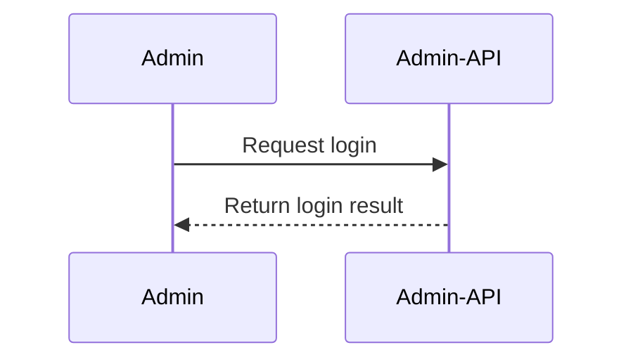
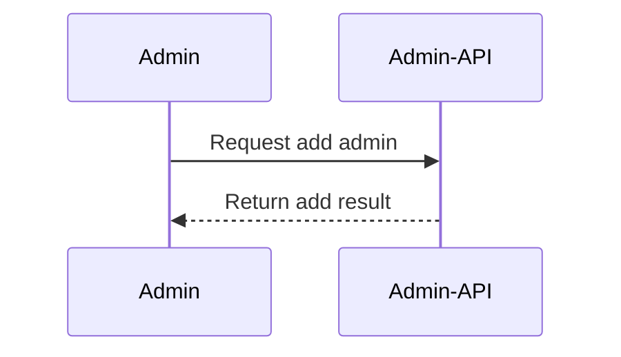
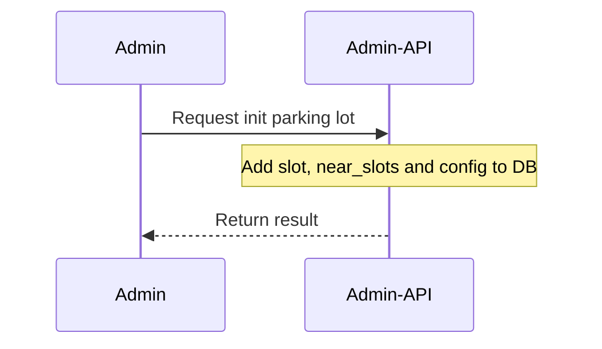
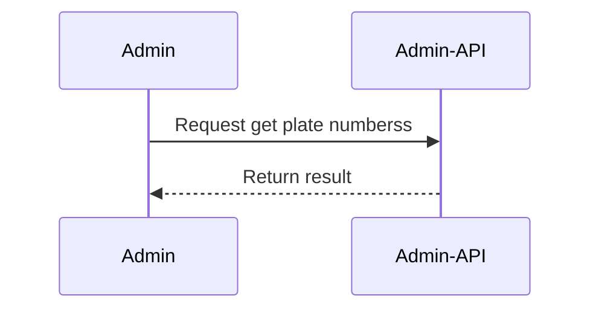
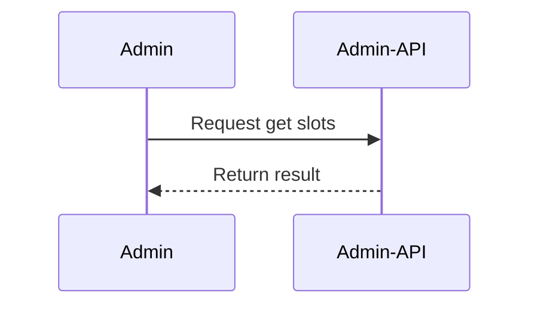
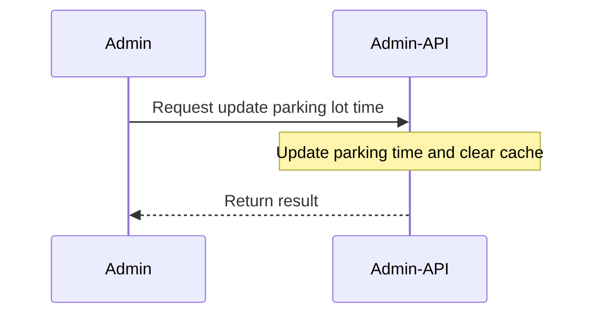
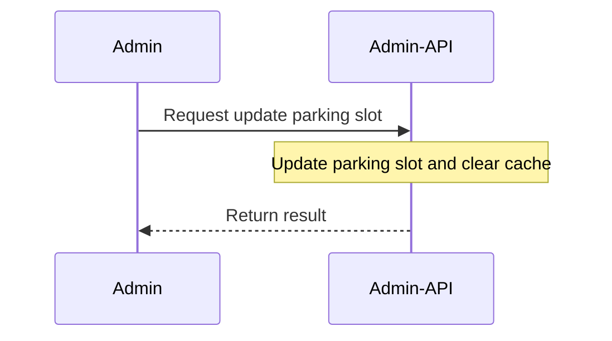

### Login API

### Add admin API

### Initail parking lot API

### Get plate number by car size API

### Get slots by car size API

### Update parking lot time API

### Update parking slot API

### Update parking price API
