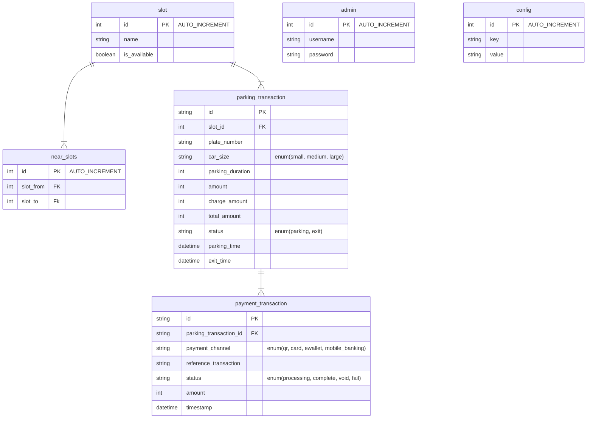

```mermaid
    erDiagram
    slot 1--1+ near_slots : ""
    slot {
        int id PK "AUTO_INCREMENT"
        string name
        boolean is_available
    }
    near_slots {
        int id PK "AUTO_INCREMENT"
        int slot_from FK
        int slot_to Fk
    }
    slot 1--1+ parking_transaction : ""
    parking_transaction {
        string id PK
        int slot_id FK
        string plate_number
        string car_size "enum(small, medium, large)"
        int parking_duration
        int amount
        int charge_amount
        int total_amount
        string status "enum(parking, exit)"
        datetime parking_time
        datetime exit_time
    }
    parking_transaction 1--1+ payment_transaction : ""
    payment_transaction {
        string id PK
        string parking_transaction_id FK
        string payment_channel "enum(qr, card, ewallet, mobile_banking)"
        string reference_transaction
        string status "enum(processing, complete, void, fail)"
        int amount
        datetime timestamp
    }
    admin {
        int id PK "AUTO_INCREMENT"
        string username
        string password

    }
    config {
        int id PK "AUTO_INCREMENT"
        string key
        string value
    }
```