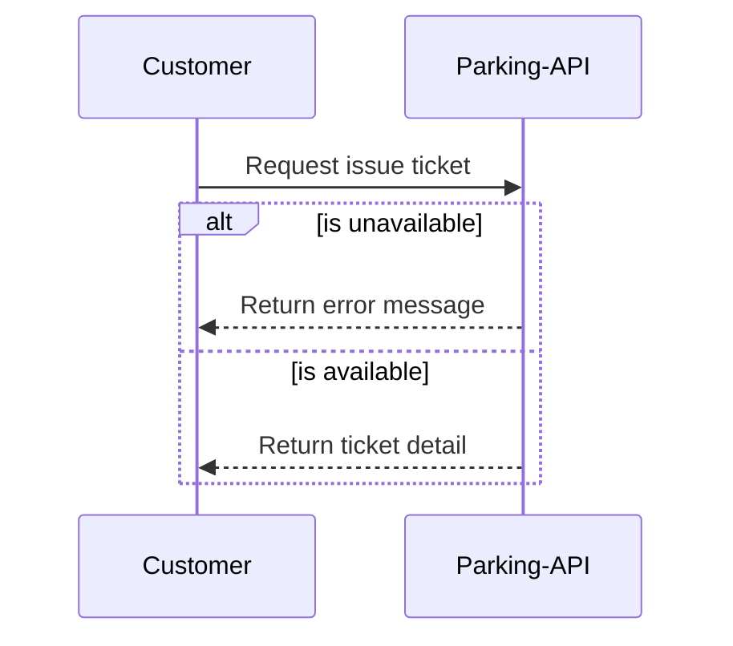
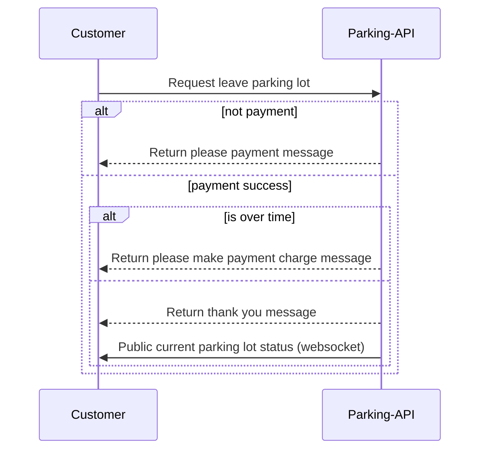
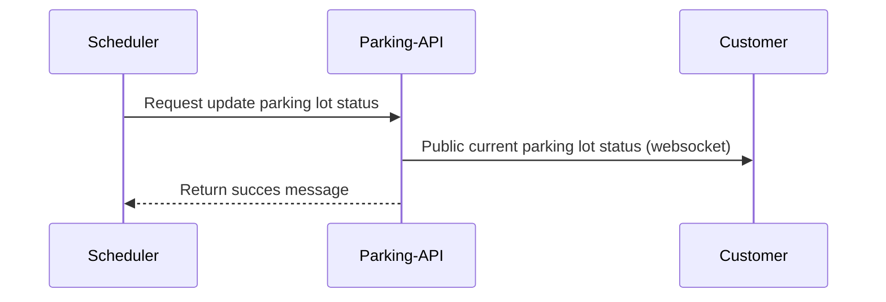

### Parking API

```mermaid
    sequenceDiagram
        Customer->>Parking-API: Request issue ticket
        alt is unavailable
            Parking-API-->>Customer: Return error message
        else is available
            Parking-API-->>Customer: Return ticket detail
        end
```

### Exit parking lot API

```mermaid
    sequenceDiagram
        Customer->>Parking-API: Request leave parking lot
        alt not payment
            Parking-API-->>Customer: Return please payment message
        else payment success
            alt is over time
                Parking-API-->>Customer: Return please make payment charge message
            else
                Parking-API-->>Customer: Return thank you message
                Parking-API->>Customer: Public current parking lot status (websocket)
            end
        end
```

### Update parking lot status API

```mermaid
    sequenceDiagram
        Scheduler->>Parking-API: Request update parking lot status
        Parking-API->>Customer: Public current parking lot status (websocket)
        Parking-API-->>Scheduler: Return succes message
```