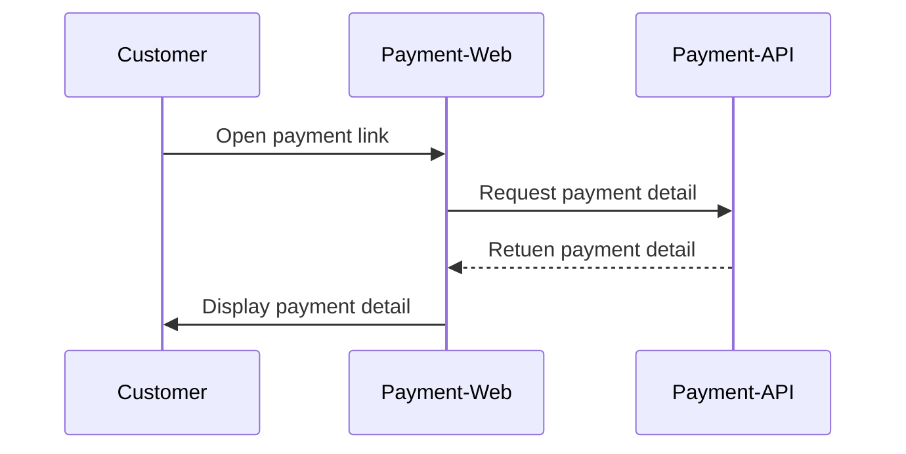
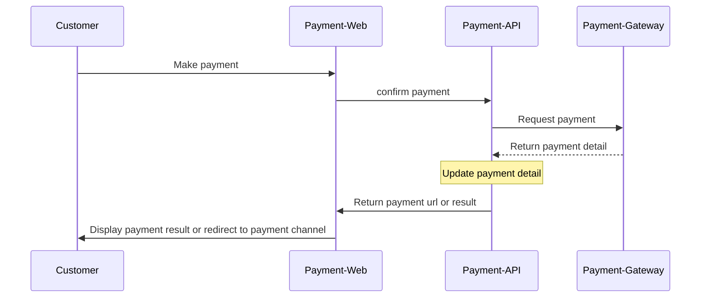
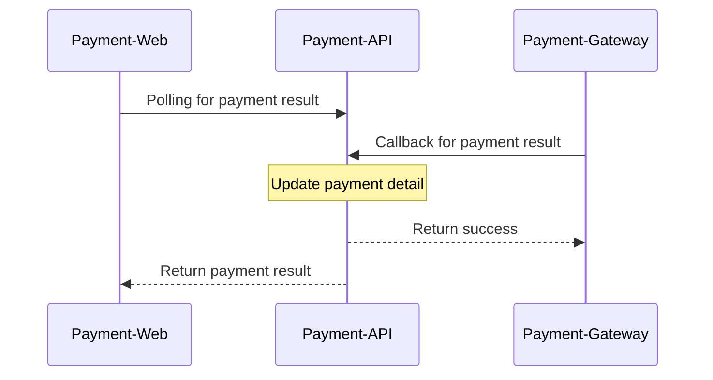

### Request payment API

```mermaid
    sequenceDiagram
        Customer->>Payment-Web: Open payment link
        Payment-Web->>Payment-API: Request payment detail
        Payment-API-->>Payment-Web: Retuen payment detail
        Payment-Web->>Customer: Display payment detail
```

### Confirm payment API

```mermaid
    sequenceDiagram
        Customer->>Payment-Web: Make payment
        Payment-Web->>Payment-API: confirm payment
        Payment-API->>Payment-Gateway: Request payment
        Payment-Gateway-->>Payment-API: Return payment detail
        Note over Payment-API: Update payment detail
        Payment-API->>Payment-Web: Return payment url or result
        Payment-Web->>Customer: Display payment result or redirect to payment channel
```

### Payment callback API

```mermaid
    sequenceDiagram
        Payment-Web->>Payment-API: Polling for payment result
        Payment-Gateway->>Payment-API: Callback for payment result
        Note over Payment-API: Update payment detail
        Payment-API-->>Payment-Gateway: Return success
        Payment-API-->>Payment-Web: Return payment result
```